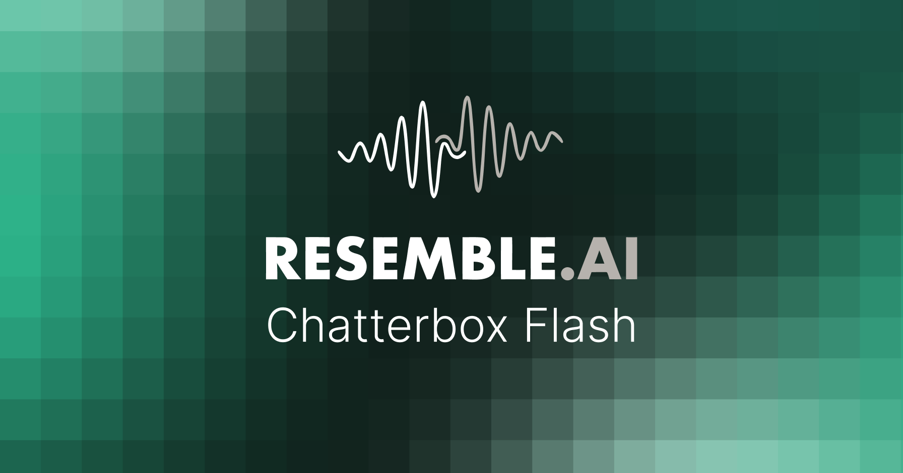

<p align="center">
  
</p>

# Chatterbox Flash
[](https://resemble-ai.github.io/chatterbox_flash_demopage/)
[](https://discord.gg/rJq9cRJBJ6)

*Made with ♥️ by* <a href="https://resemble.ai" target="_blank"></a>

**Prior-calibrated block-diffusion zero-shot TTS, extending
[Chatterbox-TTS](https://github.com/resemble-ai/chatterbox) with a parallel
masked decoder while preserving streaming generation.**

Chatterbox-Flash replaces the autoregressive T3 decoder of Chatterbox-TTS with a
[Fast-dLLM v2](https://arxiv.org/abs/2509.26328)-style block-diffusion decoder,
adds two inference-time techniques described in our paper —
**prior-calibrated PMI scoring** and **early decoding via a time-shifted quantile
schedule** — and reuses the original S3Gen flow-matching vocoder, Metavoice
voice encoder, and English tokenizer unchanged.

The released package is **inference-only**. Training code is intentionally
omitted; all reproductions of the paper's numbers can be driven from the
scripts in this repository given the released checkpoints.

## Installation

### Recommended: [uv](https://github.com/astral-sh/uv)

First create and activate a virtual environment:

```bash
uv venv                       # creates .venv with a compatible Python
source .venv/bin/activate     # Windows: .venv\Scripts\activate
```

`chatterbox-tts==0.1.7` (our base dependency) pins `torch==2.6.0`, but most
modern CUDA wheels in the stack (`torchvision`, `xformers`, `flash-attn`,
`flashinfer-python`) only ship matched ABI binaries for **torch 2.7.x**. Our
`pyproject.toml` declares a [`[tool.uv] override-dependencies`](pyproject.toml)
section that tells `uv` to honour the 2.7.x pin and skip the upstream 2.6
constraint, so a single command produces a consistent environment:

```bash
# Core — uv reads tool.uv.override-dependencies automatically:
uv pip install chatterbox-flash

# Optional — high-throughput inference backend (FlashInfer, CUDA):
uv pip install "chatterbox-flash[flashinfer]"

# Optional — Apple Silicon native Metal backend (mlx + mlx-lm, macOS only):
uv pip install "chatterbox-flash[mlx]"

# Optional — full evaluation suite (SIM-o / WER / UTMOS via OmniVoice):
uv pip install "chatterbox-flash[eval]"
```

If `uv` ever fails on a `torchvision` ABI mismatch
(`RuntimeError: operator torchvision::nms does not exist`) or a
`flash_attn_2_cuda` undefined symbol, force a torch-2.7-matched torchvision:

```bash
uv pip install 'torchvision>=0.22,<0.23'
```

### Alternative: plain pip

`pip` does not understand `[tool.uv]`, so you need to install with
`--upgrade torch torchaudio` after the initial resolve to undo the chatterbox-tts
2.6 pin manually:

```bash
pip install chatterbox-flash
pip install --upgrade 'torch>=2.7,<2.8' 'torchaudio>=2.7,<2.8' 'torchvision>=0.22,<0.23'
```

### Local install from source (development)

Clone the repository and install in editable mode so source edits take effect
without reinstalling. Pick the extras for your hardware:

```bash
git clone https://github.com/resemble-ai/chatterbox-flash.git
cd chatterbox-flash

# CUDA box (FlashInfer + eval):
uv pip install -e ".[flashinfer,eval]"

# Apple Silicon (Metal backend):
uv pip install -e ".[mlx]"

# Minimal (CPU / torch SDPA only):
uv pip install -e .
```

### Engine selection at runtime

Pick the hardware path via `--backend` on `synthesize.py` — see the table
in [Quick start](#quick-start). From the Python API, pass the lower-level
engine name (`flashinfer` / `torch` / `mlx`):

```python
from chatterbox_flash import FLASHINFER_AVAILABLE, MLX_AVAILABLE, ChatterboxFlashTTS

tts = ChatterboxFlashTTS.from_pretrained("ResembleAI/chatterbox-flash", device="cuda")
wav = tts.generate(text, audio_prompt_path="ref.wav", backend="torch")
```

`CHATTERBOX_FLASH_ENGINE={flashinfer,torch,mlx}` forces an engine per
process (handy in CI/CD).

## Quick start

A single entry-point `synthesize.py` covers all four hardware paths via
one `--backend` flag. One reference voice + one or many texts (a single
text is just a batch of one).

| `--backend`       | Engine     | Device | dtype | CUDA graph | Notes |
| ---               | ---        | ---    | ---   | ---        | --- |
| `gpu` (default)   | torch SDPA | cuda   | bf16  | on         | No JIT cold start |
| `flashinfer`      | FlashInfer | cuda   | bf16  | on         | Paged KV; warmup-amortised throughput |
| `cpu`             | torch SDPA | cpu    | fp16  | off        | CPU-only validation / Docker (`--dtype fp32` to fall back) |
| `mlx`             | mlx (Metal)| cpu*   | fp16  | off        | Apple Silicon native (`[mlx]` extra) |

\* MLX runs the LLaMA backbone on Metal; the PyTorch side stays on CPU.

Override the per-backend compute dtype with `--dtype {bf16,fp16,fp32}`. CPU
defaults to fp16 (PyTorch 2.x has CPU fp16 kernels); use `--dtype fp32` if a
fp16 op is unsupported or slower on your hardware.

**4-bit / 8-bit quantization (MLX only):** `--quantize_bits {4,8}` quantizes the
T3 LLaMA backbone via `mlx.nn.quantize` (the S3Gen vocoder and voice encoder
stay in `--dtype`). Tune the group size with the
`CHATTERBOX_FLASH_MLX_QUANT_GROUP` env var (default 64). There is no CPU
quantization path — PyTorch CPU has no native 4-bit kernels; use bf16/fp16 on
CPU, or MLX quantization on Apple Silicon.

```bash
# Apple Silicon, 4-bit quantized backbone
python synthesize.py --audio_prompt reference.wav --text "..." \
    --backend mlx --quantize_bits 4
```

```bash
# Default — GPU + torch SDPA
python synthesize.py --audio_prompt reference.wav \
    --text "Sometimes it's better to just let things slide, you know?"

# GPU + FlashInfer (paged KV + CUDA graph)
python synthesize.py --audio_prompt reference.wav --text "..." --backend flashinfer

# CPU only
python synthesize.py --audio_prompt reference.wav --text "..." --backend cpu

# Apple Silicon native Metal
python synthesize.py --audio_prompt reference.wav --text "..." --backend mlx

# Multiple sentences; 8 rows per batched forward
python synthesize.py --audio_prompt reference.wav \
    --text "First sentence." "Second sentence." "Third sentence." \
    --batch_size 8

# From a file (one sentence per line, '#' lines and blanks ignored)
python synthesize.py --audio_prompt reference.wav --text_file sentences.txt
```

Defaults reproduce the paper's best decoding setup. CFG, when on
(`--cfg_scale > 0`), is locked to the production combination — `zero_text_batch`
+ `zero_all` null + null-text zeroed + null-speech duplicated + PMI combined
via `pmi_cfg` ((1+w)·pmi_c − w·pmi_u) — no other CFG mode is exposed.
Other defaults: OmniVoice r_n schedule (`omnivoice_schedule_t_shift=0.5`),
position temperature T=5, precomputed unconditional block prior,
S3Gen meanflow vocoding at 2 CFM steps. Override per run via `--num_steps`,
`--temperature`, `--time_shift_tau`, `--cfg_scale`, `--n_cfm_timesteps`,
`--position_temperature`.

### Python API

```python
import torchaudio as ta
from chatterbox_flash import ChatterboxFlashTTS

model = ChatterboxFlashTTS.from_pretrained("ResembleAI/chatterbox-flash", device="cuda")
wav = model.generate(
    "Sometimes it's better to just let things slide, you know?",
    audio_prompt_path="reference.wav",
)
ta.save("out.wav", wav, model.sr)
```

## Reproducing the paper benchmarks

```bash
# Downloads the released checkpoint from the Hugging Face Hub + OmniVoice's
# eval datasets/models, generates wavs, then scores SIM-o / WER / UTMOS using
# the same code OmniVoice publishes.
bash scripts/run_eval.sh
```

Defaults reproduce the Table 1 configuration from our paper
(block size 16, max 10 steps per block, temperature 0.6, time-shift τ=0.1,
CFG scale 1.0, zero-text-batch + `pmi_cfg` + `zero_all` null prefix).

## Unified continuous-batching server

`server.serve` is the common worker entry point for all three engines. Each
worker owns one model and one GPU, while every engine uses the same thread-safe
priority admission queue, wakeup lifecycle, model registry, metrics surface,
and raw 24kHz PCM API:

```bash
HIP_VISIBLE_DEVICES=0 python -m server.serve --model flash --port 8020
HIP_VISIBLE_DEVICES=1 python -m server.serve --model turbo --port 8021
HIP_VISIBLE_DEVICES=2 python -m server.serve --model kokoro --port 8030
```

Canonical Hugging Face IDs are accepted interchangeably:

```bash
python -m server.serve --model ResembleAI/chatterbox-flash --port 8020
python -m server.serve --model ResembleAI/chatterbox-turbo --port 8021
python -m server.serve --model hexgrad/Kokoro-82M --port 8030
```

The execution cadence remains model-specific. Turbo admits work between
autoregressive token ticks, Flash between block-diffusion ticks, and Kokoro
between exact-length acoustic batches. This preserves each model's inference
math while sharing vLLM-style admission and fleet routing.

Put heterogeneous workers behind one model-aware endpoint:

```bash
python -m server.router \
  --upstream http://127.0.0.1:8020 http://127.0.0.1:8021 http://127.0.0.1:8030 \
  --capacity 128 256 384 \
  --default-model ResembleAI/chatterbox-turbo
```

Requests use a small common envelope and a strict model-specific dictionary:

```json
{
  "model": "hexgrad/Kokoro-82M",
  "text": "This request uses Kokoro.",
  "priority": "interactive",
  "model_options": {
    "voice": "af_heart",
    "language": "a",
    "speed": 1.0
  }
}
```

`text`, `model`, and `priority` have the same meaning for every engine.
Model-specific keys outside `model_options`, unknown options, and non-object
`model_options` are rejected. Each worker logs its complete JSON capability
document at startup and returns it from `GET /healthz`. The router merges voice
availability across compatible shards and includes capabilities in
`GET /v1/models` and its own `GET /healthz`.

### Direct OpenAI speech API

Every `server.serve` worker exposes `POST /v1/audio/speech`; the router is not
required. Point an OpenAI client at the worker and use any non-empty API key:

```python
from openai import OpenAI

client = OpenAI(base_url="http://127.0.0.1:8030/v1", api_key="unused")
with client.audio.speech.with_streaming_response.create(
    model="tts-1",
    voice="alloy",
    input="This request goes directly to the Kokoro worker.",
    response_format="pcm",
) as response:
    for pcm_chunk in response.iter_bytes():
        consume_pcm_s16le_24khz_mono(pcm_chunk)
```

The standard `tts-1`, `tts-1-hd`, and `gpt-4o-mini-tts` model names select the
model loaded by that worker. Canonical Hugging Face model IDs also work.
Built-in OpenAI voice names select the base Chatterbox voice; Kokoro maps known
equivalents when loaded and otherwise uses its configured default voice.
Registered Turbo LoRA names and loaded Kokoro voice names remain selectable
directly.

`response_format` accepts `mp3` (the default), `opus`, `aac`, `flac`, `wav`,
and raw `pcm`. PCM is streamed as signed little-endian 16-bit, mono, 24kHz
audio. `stream_format="sse"` emits `speech.audio.delta` and
`speech.audio.done` events. Unsupported controls and malformed requests use
the OpenAI error envelope. `GET /v1/models` reports the worker's loaded model
and capabilities.

### Container image

Every push to `master` or `main`, and every `v*` tag, publishes a CUDA-capable
image to `ghcr.io/m8than/yapd`. The image starts the Flash worker by default:

```bash
docker run --rm --gpus all -p 8020:8020 ghcr.io/m8than/yapd:latest
```

Arguments after the image name are passed to `server.serve`, so the same image
can run another worker:

```bash
docker run --rm --gpus all -p 8030:8030 ghcr.io/m8than/yapd:latest \
  --model kokoro --host 0.0.0.0 --port 8030
```

## Dynamic LoRA voices in the Turbo server

The continuous-batching Turbo server can apply different PEFT LoRA adapters
to different rows in the same batch without merging them into the base model.
Register trusted adapters at startup using vLLM-style `name=path` entries:

```bash
python -m server.serve --model turbo \
  --lora-modules voice-a=/srv/voices/a voice-b=org/voice-b \
  --max-lora-rank 64
```

Each adapter must contain `adapter_config.json` and
`adapter_model.safetensors`. GPT-2 `c_attn`, attention `c_proj`, `c_fc`, and
MLP `c_proj` targets are supported. Adapter bias, DoRA, `modules_to_save`, and
incomplete or incorrectly shaped A/B pairs are rejected.

Select a registered adapter through `model_options.voice`:

```bash
curl -X POST http://localhost:8020/tts \
  -H 'Content-Type: application/json' \
  -d '{"model":"ResembleAI/chatterbox-turbo","text":"This request uses voice A.","model_options":{"voice":"voice-a"}}' \
  --output voice-a.pcm
```

Use `"voice":"base"` for the unadapted model. `GET /healthz` lists registered
adapters and advertises them in the `voice` option enum. The multi-shard router
routes a request only to a worker that loaded the selected voice. Filesystem or
Hub paths are never accepted from inference requests.


## Kokoro-82M backend

`server.kokoro_app` serves the Apache-2.0 `hexgrad/Kokoro-82M` v1.0 model
through the same raw 24kHz PCM `/tts` contract:

```bash
HIP_VISIBLE_DEVICES=0 python -m server.serve --model kokoro \
  --port 8030 --dtype fp32 --batch-size 384 --chunk-chars 512
```

Select any loaded canonical Kokoro v1.0 voice through `model_options`:

```json
{
  "model": "hexgrad/Kokoro-82M",
  "text": "This request uses Kokoro.",
  "model_options": {"voice": "af_heart", "speed": 1.0}
}
```

The backend preloads all 54 canonical voice packs and exposes them through
`GET /healthz`. Japanese and Mandarin phonemization require the declared
`misaki[ja,zh]` dependencies; Japanese also requires the UniDic dictionary.
The heterogeneous router discovers model and voice capabilities from each
backend and routes only to a server that supports the requested combination.

Kokoro's bidirectional recurrent text encoders make ordinary padded inference
incorrect: padding changes valid waveform rows. The backend therefore uses
exact-token-length microbatches, then groups decoder rows by predicted frame
length. A deadline-ordered continuous scheduler batches whole router segments;
it does not subdivide text to improve batch occupancy. The deployment preserves
the same router/load-balancer contract
as the Chatterbox engines. Canonical FP32 execution preserves the released
voice model's waveform quality. API text segmentation and four-second
lookahead remain at the router layer; the backend only splits text that exceeds
its 512-character context boundary.

## Project layout

```
synthesize.py             ← single CLI entry point; one ref + many texts; --backend selects engine

chatterbox_flash/
├── model.py              ChatterboxFlashT3: chatterbox T3 + MASK token + block-diffusion generate()
├── tts.py                ChatterboxFlashTTS — user-facing pipeline (T3 + S3Gen + VE + tokenizer)
├── cfg_guidance.py       Classifier-free guidance helpers (zero-text-batch + PMI-side combination)
├── calibration.py        Prior-calibrated PMI scoring
├── engines/              Pluggable inference backends
│   ├── base.py             InferenceEngine protocol
│   ├── flashinfer.py       Paged KV + CUDA-graph FlashInfer engine (CUDA, preferred)
│   ├── torch_sdpa.py       Pure-PyTorch SDPA + DynamicCache fallback (CPU/CUDA/MPS)
│   ├── mlx.py              Apple-Silicon Metal engine via mlx + mlx-lm (experimental)
│   └── __init__.py         build_engine() — picks the backend, honours $CHATTERBOX_FLASH_ENGINE
├── text_norm/            English text normalization (numbers, abbreviations, dates, times, phones)
└── eval/                 OmniVoice JSONL generation + WER (Whisper, seedtts-eval style)

scripts/
└── run_eval.sh           Full evaluation pipeline (download → generate → score)
```

## Citation

**Paper:**

```bibtex
@misc{seo2026chatterboxflashpriorcalibratedblockdiffusion,
      title={Chatterbox-Flash: Prior-Calibrated Block Diffusion for Streaming Zero-Shot TTS},
      author={Deokjin Seo and Gangin Park and Kihyun Nam},
      year={2026},
      eprint={2605.30748},
      archivePrefix={arXiv},
      primaryClass={cs.SD},
      url={https://arxiv.org/abs/2605.30748},
}
```

**Software (this repository):**

```bibtex
@software{chatterboxflash2026,
      author={Deokjin Seo and Gangin Park and Kihyun Nam},
      title={Chatterbox-Flash},
      year={2026},
      publisher={Resemble AI},
      url={https://github.com/resemble-ai/chatterbox-flash},
}
```

## License

MIT (see [LICENSE](LICENSE)).

The base architecture, S3Gen vocoder, voice encoder and tokenizer are
provided by [chatterbox-tts](https://github.com/resemble-ai/chatterbox)
(also MIT-licensed).
